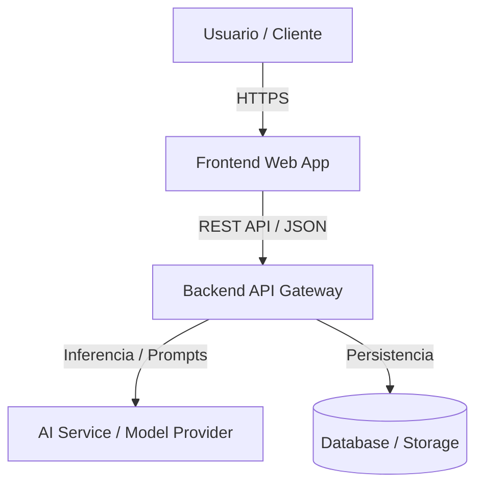

# Diagrama de Arquitectura de Contenedores (Nivel C2)

> Archivo entregable de la Fase 1 (12:00 PM) para auditoria de jurados.

```mermaid
graph TD
    User["Usuario / Cliente"] -->|HTTPS| WebApp["Frontend Web App"]
    WebApp -->|REST API / JSON| Backend["Backend API Gateway"]
    Backend -->|Inferencia / Prompts| AIService["AI Service / Model Provider"]
    Backend -->|Persistencia| Database[("Database / Storage")]
```
